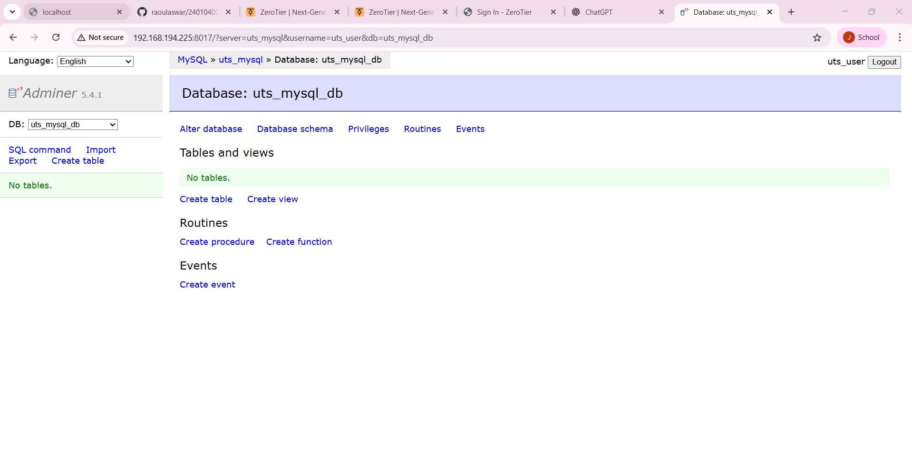

# 240104004-udb-uts
240104004-udb-uts
ZeroTier Network ID : 60ee7c034ac276d1
ZeroTier IP Host    : 192.168.191.10
Adminer Port        : 8017
---
## Identitas:
- nama:jalalludin raoul aswar
- nim:240104004
- mata kuliah:manajemen jaringan
- tahun:2025

## Informasi Akses
- port adminer:8017
- IP Zerotier : 192.168.194.225

## Cara menjalankan Project

### Clone Repository
git clone https://github.com/raoulaswar/240104004-udb-uts.git

## Screenshot Wajib

